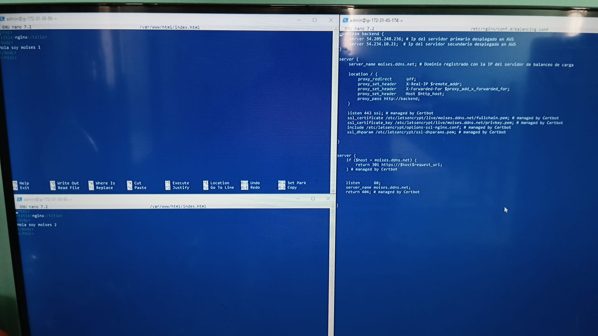

creamo los 3 servidores en aws

y lo configuramos de esta manera

aqui os dejo un video de como quedaria al actualizar se iria repartiendo carga de una pagina a otra

[prueba de balance de carga](https://youtu.be/xgqbXIVDnGQ)
