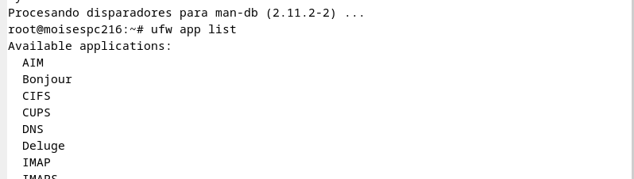

en primer lugar actualizamos un apt update por si acaso y en caso de actualizaciones apt upgrade

empezamos instalando

segundo inicializamos nginx

comprobamos el servicio

vamos a permitir http nginx con este comando

luego vamos a comprobar la lista de perfiles con este comando

si como yo en debian no os aparece el comando ufw tendreis que instalarlo de esta manera

